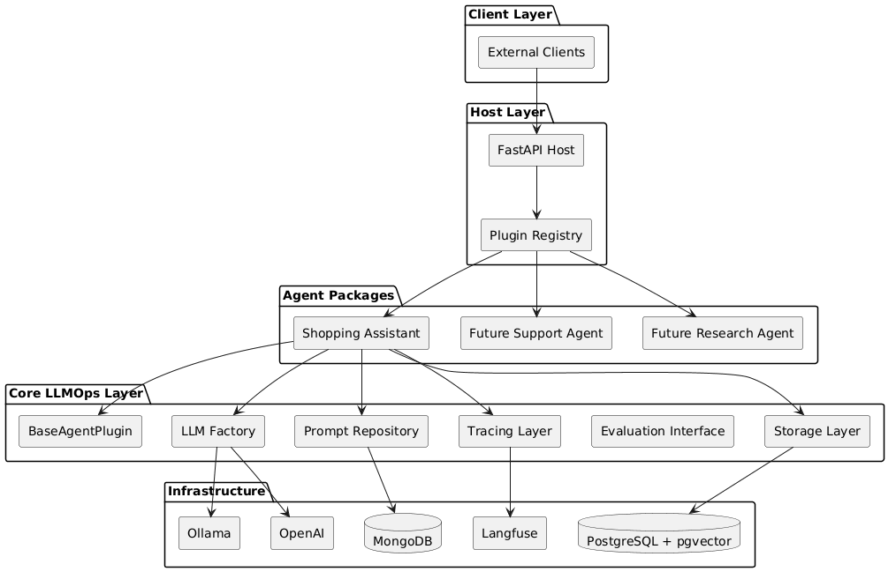
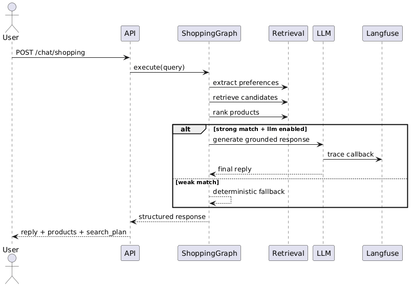
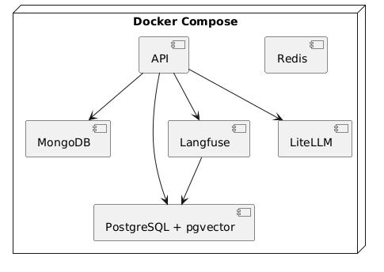
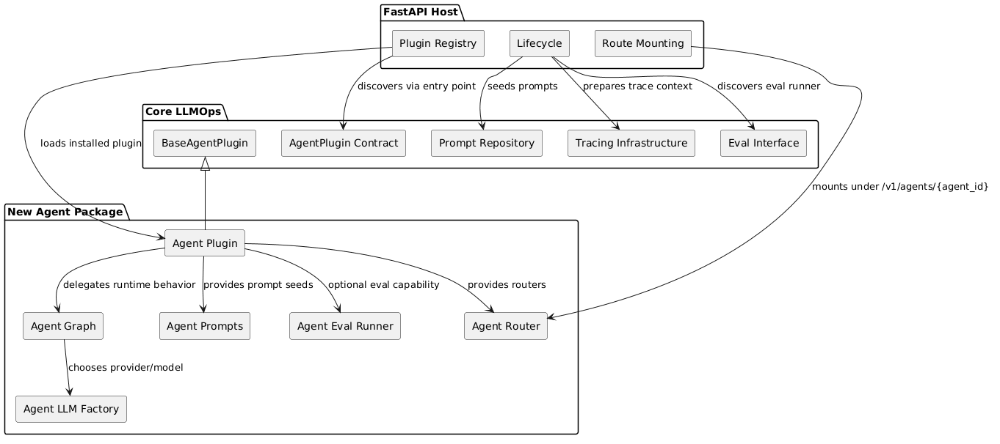

# RFC — Plugin-Based LLMOps Platform (Agent-Agnostic Core + Self-Contained Agents)

## Executive Summary

This RFC defines the architecture of the LLMOps Platform as an agent-agnostic infrastructure layer that supports multiple independent AI agents as installable plugins.

The platform itself is not a shopping assistant, support bot, or research system. It is an operational and architectural foundation for running many agents consistently with shared capabilities such as:

* FastAPI hosting
* plugin discovery
* model/provider abstraction
* prompt storage and versioning
* tracing and observability
* evaluation infrastructure
* PostgreSQL + pgvector support
* MongoDB prompt repository
* Langfuse tracing
* Docker-based local development

The `shopping_assistant` is the first concrete agent and serves as the reference implementation of how an agent should consume the platform. It is not part of the platform core.

---

# 1. Motivation

The initial implementation started with a concrete shopping assistant and gradually evolved into a broader LLMOps platform.

This revealed a common failure mode:

> infrastructure starts becoming shaped by the first agent.

Examples of architectural drift:

* host application knowing shopping-specific routes
* prompt systems coupled to one use case
* retrieval endpoints existing without a real generic agent need
* model/provider decisions controlled by the host instead of the agent
* tracing and eval implemented only for one agent

This creates long-term problems:

* hard to add new agents
* difficult to maintain boundaries
* duplicated infra logic
* brittle deployments
* weak observability consistency

The platform was refactored to enforce a stronger principle:

> Core owns infrastructure. Agents own business logic.

---

# 2. Goals

## Primary Goals

1. Keep the platform fully independent from any concrete agent
2. Allow new agents to be added without changing the host
3. Support multiple providers per agent (Ollama, OpenAI, Anthropic, etc.)
4. Keep agents self-contained packages
5. Centralize operational concerns in reusable infrastructure
6. Make local development reproducible via Docker + Makefile
7. Support tracing and evaluation as generic capabilities

## Non-Goals

This RFC does not aim to:

* create a universal RAG endpoint
* expose generic `/chat`, `/documents`, `/prompts` HTTP APIs
* force all agents to use the same graph
* force a single provider/model strategy
* move business logic into the core platform

---

# 3. High-Level Architecture

## Layered View


---

# 4. Core Architecture

## 4.1 FastAPI Host

The host is intentionally thin.

Responsibilities:

* lifecycle management
* dependency initialization
* plugin discovery
* route mounting
* health and metrics endpoints
* shared infra initialization

It should not contain:

* shopping logic
* retrieval logic
* agent prompts
* provider decisions

Only generic routes remain:

* `/`
* `/health`
* `/metrics`
* `/v1/agents/{agent_id}/...`

---

## 4.2 Plugin Discovery

Agents are discovered through Python entry points.

This enables:

* installable agents
* isolated ownership
* zero host changes for new agents

The registry loads plugins using:

```text
llmops.agent_plugins
```

This preserves strict decoupling.

---

## 4.3 BaseAgentPlugin

A minimal reusable abstraction exists for infrastructure capabilities.

Required behavior stays small.

Optional no-op capabilities include:

* prompt seed documents
* startup hooks
* shutdown hooks
* trace metadata
* evaluation runner

This prevents infrastructure from becoming shopping-specific.

---

## 4.4 Prompt Management

Prompts are stored in MongoDB.

Reasons:

* versioning
* environment portability
* runtime updates
* separation from code deployments

Agents provide prompt seed documents.

Core provides:

* repository abstraction
* Mongo implementation
* seeding lifecycle

---

## 4.5 Model Abstraction

Model selection is agent-scoped.

Examples:

* shopping → Ollama + Llama
* support → OpenAI
* research → Anthropic

Core provides:

* provider abstraction
* model factory

Agents decide:

* provider
* model
* fallback policy

This is a critical architectural boundary.

---

## 4.6 Tracing

Tracing is infrastructure, not agent logic.

Core owns:

* Langfuse initialization
* callback wiring
* RunnableConfig propagation

Agents provide only:

* metadata
* tags
* semantic labels

This keeps observability consistent across agents.

---

## 4.7 Evaluation

Evaluation is modeled as an agent capability.

Core owns:

* eval abstraction
* execution pattern

Agents own:

* datasets
* assertions
* scoring logic

This avoids generic meaningless eval systems.

---

# 5. Shopping Assistant (Reference Agent)

## Important Principle

The shopping assistant is:

> a use case of the platform

not:

> the platform itself

It demonstrates how a real agent should be implemented.

---

## Responsibilities

The shopping assistant owns:

* graph orchestration
  n- deterministic retrieval
* ranking
* semantic filtering
* product catalog
* prompts
* shopping evaluation datasets
* shopping-specific tracing metadata

It does not own:

* FastAPI hosting
* generic tracing
* generic eval infrastructure
* prompt repository implementation

---

## Agent Flow


---

# 6. Infrastructure Stack

## Runtime Services



Profiles allow:

* shared infra only
* specific agents only
* multiple agents together

This supports future multi-agent operation.

---

# 7. How to Implement a New Agent

A new agent must be implemented as an independent package under packages/agents/. The platform should not be modified to support the new agent, except for installing the new package and enabling its Docker profile/environment when needed.

Required Agent Package Structure

A typical agent package should look like this:

```
packages/agents/<agent_name>/
  <agent_name>/
    app/
      router.py
      schemas.py
    orchestration/
      graph.py
    prompts/
      documents.py
    evals/
      datasets/
      runner.py
    llm/
      factory.py
    plugin.py
    config.py
  pyproject.toml
  README.md
```
The agent owns its domain logic, graph, prompts, provider configuration, eval datasets, and route implementation.

The platform owns plugin discovery, shared tracing, prompt repository, and host lifecycle.

## Agent Plug-In Contract




### Adding a New Agent

#### Required Implementation Steps:

1. Create a new package under packages/agents/<agent_name>.
2. Implement plugin.py using BaseAgentPlugin.
3. Implement the agent router and expose only agent-specific endpoints.
4. Implement the agent orchestration graph.
5. Define agent-specific prompt seed documents.
6. Define agent-specific model/provider configuration.
7. Optionally implement an eval runner and datasets.
8. Register the plugin entry point in the agent pyproject.toml:[project.entry-points."llmops.agent_plugins"]<agent_id> = "<agent_name>.plugin:get_agent_plugin"
9. Install the package.
10. Start the host. The new agent should be discovered automatically.

### What Must Not Be Changed

Adding a new agent should not require changes to:

- apps/api/main.py
- the host routing logic
- the plugin registry
- core prompt repository implementation
- core tracing implementation
- existing agents

If any of those need to change, the agent is not correctly isolated.

## Validation Checklist

A new agent is correctly integrated when:

- it appears in plugin discovery;
- its routes are mounted under /v1/agents/{agent_id};
- its prompt seeds load through the shared prompt repository;
- its model provider is configured inside the agent package;
- its tracing metadata is contributed through the base plugin abstraction;
- its eval runner is optional and agent-local;
- removing the agent package does not break the host.

---

# 8. Future Work

* additional agent packages
* richer eval datasets
* production deployment patterns
* stronger CI for plugin verification
* optional agent marketplace pattern
* policy enforcement for architectural boundaries

---

# Final Statement

This architecture treats LLMOps as a platform.

Agents are products.

The platform must survive even if the first agent disappears.

That is the architectural standard this RFC establishes.
